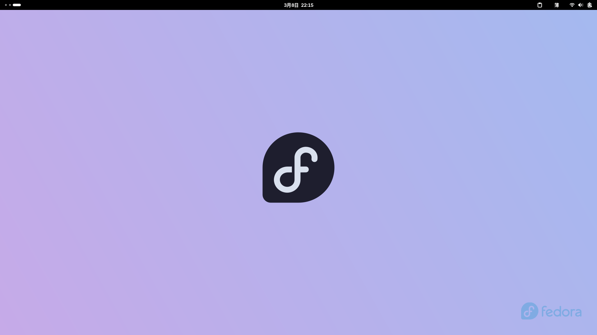

# 🎩 欢迎加入 Fedora 大家庭！

> **Fedora** 是一个由社区驱动的 Linux 发行版，以创新、自由和前沿技术著称。如果你是第一次接触 Linux，这篇文章将带你从零开始了解 Fedora，并帮助你完成第一次安装。



## 为什么选择 Fedora？

Fedora 不仅仅是一个操作系统，它是一个充满活力的社区，致力于推广自由开源软件。以下是选择 Fedora 的几个理由：

### 🚀 始终走在技术前沿

Fedora 是新技术和新功能的试验田。许多在 Red Hat Enterprise Linux (RHEL) 中稳定运行的功能，最初都诞生于 Fedora。这意味着你总能体验到最新的 Linux 技术。

### 🔒 开箱即用的安全

Fedora 默认启用 SELinux（安全增强型 Linux），为你的系统提供企业级的安全防护。同时，系统更新及时，安全补丁推送迅速。

### 🎨 精美的桌面体验

Fedora Workstation 版采用 GNOME 桌面环境，界面简洁现代，对新手非常友好。当然，如果你喜欢 KDE、Xfce 或其他桌面环境，也有相应的版本供你选择。

### 🤝 活跃的社区支持

遇到问题？Fedora 拥有庞大的中文和国际社区。无论是论坛、聊天群还是文档，你都能找到热心的帮助。

## Fedora 有哪些版本？

Fedora 提供多个版本，满足不同用户的需求：

| 版本 | 适用场景 | 特点 |
|------|----------|------|
| **Workstation** | 日常桌面使用 | GNOME 桌面，适合办公、娱乐、开发 |
| **Silverblue** | 追求稳定的用户 | 不可变系统，原子级更新，适合开发者 |
| **Server** | 服务器环境 | 精简安装，适合部署服务 |
| **IoT** | 物联网设备 | 为嵌入式和 IoT 设备优化 |
| **CoreOS** | 容器化部署 | 专为容器和 Kubernetes 设计 |

**新手推荐**：从 **Fedora Workstation** 开始，它提供了最完整的桌面体验。

## 安装 Fedora：一步一步来

### 第一步：下载 Fedora

访问 [Fedora 官方下载页面](https://getfedora.org/)，选择 Workstation 版本下载。

文件大小约为 2GB，建议在网络稳定的环境下下载。

### 第二步：制作启动盘

你需要一个至少 8GB 的 U 盘。推荐使用以下工具制作启动盘：

**Windows 用户**：
- [Rufus](https://rufus.ie/) - 轻量且强大的启动盘制作工具
- [Fedora Media Writer](https://getfedora.org/en/workstation/download/) - Fedora 官方推荐

**macOS 用户**：
- [balenaEtcher](https://www.balena.io/etcher/) - 跨平台，简单易用
- 终端命令：`sudo dd if=fedora.iso of=/dev/diskX bs=4m`

**Linux 用户**：
```bash
# 使用 dd 命令（将 /dev/sdX 替换为你的 U 盘设备）
sudo dd if=Fedora-Workstation-Live.iso of=/dev/sdX bs=4M status=progress
```

### 第三步：启动并安装

1. 将制作好的启动盘插入电脑
2. 重启电脑，按 **F12**（或 **F2**、**Del**，视主板而定）进入启动菜单
3. 选择 U 盘启动
4. 选择 "Try Fedora" 先体验，或直接选择 "Install to Hard Drive"

### 第四步：配置系统

安装程序会引导你完成以下设置：

- **语言**：选择 "中文（简体）"
- **键盘布局**：通常保持默认即可
- **安装目的地**：选择要安装的硬盘（⚠️ **注意**：这会格式化硬盘！）
- **用户设置**：创建你的用户名和密码

整个过程大约需要 15-30 分钟，取决于你的硬件性能。

## 安装后的第一件事

### 🔄 更新系统

安装完成后，首先更新系统到最新版本：

```bash
# 打开终端，运行：
sudo dnf update -y
```

更新完成后重启电脑。

### 🛠️ 安装常用软件

Fedora 使用 **DNF** 包管理器。以下是新用户常用软件的安装命令：

```bash
# 安装 Chrome 浏览器
sudo dnf install google-chrome-stable

# 安装 VS Code
sudo rpm --import https://packages.microsoft.com/keys/microsoft.asc
sudo sh -c 'echo -e "[code]\nname=Visual Studio Code\nbaseurl=https://packages.microsoft.com/yumrepos/vscode\nenabled=1\ngpgcheck=1\ngpgkey=https://packages.microsoft.com/keys/microsoft.asc" > /etc/yum.repos.d/vscode.repo'
sudo dnf install code

# 安装多媒体解码器
sudo dnf install gstreamer1-plugins-{bad-\*,good-\*,base} gstreamer1-plugin-openh264 gstreamer1-libav --exclude=gstreamer1-plugins-bad-free-devel

# 安装 Flatpak（应用商店）
sudo dnf install flatpak
flatpak remote-add --if-not-exists flathub https://flathub.org/repo/flathub.flatpakrepo
```

### 🎨 个性化设置

- **更换壁纸**：右键桌面 → 更换背景
- **安装主题**：打开 "优化" 工具（GNOME Tweaks）
- **添加扩展**：访问 [extensions.gnome.org](https://extensions.gnome.org)

## 新手常见问题

### Q: 软件在哪里下载？

Fedora 提供多种软件安装方式：

1. **GNOME 软件中心** - 图形界面，适合新手
2. **DNF 命令行** - 系统级软件包管理
3. **Flatpak** - 跨发行版应用商店
4. **Snap** - Ubuntu 推出的通用软件包

### Q: 如何安装 NVIDIA 显卡驱动？

Fedora 默认使用开源驱动。如需专有驱动：

```bash
# 启用 RPM Fusion 仓库
sudo dnf install https://download1.rpmfusion.org/free/fedora/rpmfusion-free-release-$(rpm -E %fedora).noarch.rpm
sudo dnf install https://download1.rpmfusion.org/nonfree/fedora/rpmfusion-nonfree-release-$(rpm -E %fedora).noarch.rpm

# 安装 NVIDIA 驱动
sudo dnf install akmod-nvidia

# 重启系统
sudo reboot
```

### Q: 中文输入法怎么设置？

Fedora 默认已安装 **IBus** 输入法框架：

1. 打开 "设置" → "键盘"
2. 点击 "输入源" 下方的 "+"
3. 选择 "汉语（中国）"
4. 选择你喜欢的输入法（推荐 "拼音" 或 "五笔"）

### Q: 遇到问题了怎么办？

- 📖 [Fedora 官方文档](https://docs.fedoraproject.org/zh_CN/)
- 💬 [Fedora 中文论坛](https://discuss.fedoraproject.org/c/zh-chinese/)
- 🐦 [Fedora 中文 Telegram 群](https://t.me/fedorazh)
- 🐙 [Ask Fedora](https://ask.fedoraproject.org/) - 官方问答社区

## 下一步探索

恭喜你完成了 Fedora 的安装！接下来你可以：

- 🎮 探索 [Flathub](https://flathub.org/) 上的数千款应用
- 🧑‍💻 学习 [Linux 命令行基础](https://linuxcommand.org/)
- 🐍 配置你的 [开发环境](https://developer.fedoraproject.org/)
- 🎨 参与 [Fedora 社区](https://whatcanidoforfedora.org/)，成为贡献者

---

**记住**：Linux 的学习曲线虽然陡峭，但社区的温暖和支持会让你感到宾至如归。Fedora 社区欢迎每一位新成员的加入！

> 💡 **小贴士**：保存这篇指南，当你遇到问题时随时回来查阅。也欢迎将它分享给其他想尝试 Fedora 的朋友！
